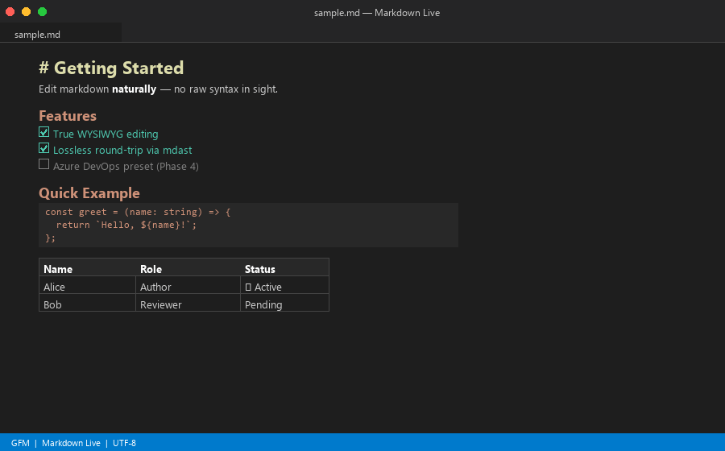

# Markdown Live



**Edit markdown the way it looks, not the way it's written.**

Markdown Live opens `.md` files directly in their rendered form. Type into headings, paragraphs, lists, tables, and links — your changes write back to the markdown source in real time. No toggling between source and preview, no raw syntax in sight.

***

## Getting started

1. Download `markdown-live-x.x.x.vsix` from the [latest release](https://github.com/Stevee-Harveyy/Markdown-Live/releases/latest)
1. In VS Code: **Extensions** (`Ctrl+Shift+X`) → `···` menu → **Install from VSIX…**
1. Open any `.md` file — Markdown Live loads automatically

Or via terminal:

```bash
code --install-extension markdown-live-x.x.x.vsix
```

> **Note:** The `code` command must be in your PATH. In VS Code, run **Shell Command: Install 'code' command in PATH** from the Command Palette if needed.

***

## Features

- **True WYSIWYG** — write in rendered markdown; never look at raw syntax
- **Full GFM support** — tables, task lists (toggle checkboxes directly), strikethrough, fenced code blocks with language
- **Lossless round-trip** — edits travel through ProseMirror → mdast → remark-stringify, not through HTML conversion, so nothing is lost or reformatted unexpectedly
- **Frontmatter preserved** — YAML front matter and raw HTML blocks display as read-only monospace blocks and survive every edit untouched
- **External change handling** — if the file changes externally (git pull, another tool) while you have local edits, a banner lets you choose: **Keep mine** or **Accept theirs**
- **Feels like a normal editor** — dirty indicator, Ctrl+S, Ctrl+Z, and file-lifecycle all handled by VS Code's `CustomTextEditor` API

***

## Settings

All settings are under **Extensions → Markdown Live** in VS Code Settings (`Ctrl+,`), or add them directly to `settings.json`.

### Editor behaviour

| Setting | Default | Description |
|---|---|---|
| `markdownWysiwyg.syncDelay` | `150` | Milliseconds to wait after the last keystroke before writing back to the source file. Lower = faster sync. |
| `markdownWysiwyg.spellCheck` | `false` | Enable browser spell checking inside the editor. |

### Appearance

| Setting | Default | Description |
|---|---|---|
| `markdownWysiwyg.maxWidth` | `"860px"` | Maximum width of the content area. Any CSS length (`720px`, `90ch`, `100%`, `none`). |
| `markdownWysiwyg.fontSize` | `"inherit"` | Font size for rendered content, e.g. `16px` or `1.1rem`. `inherit` follows VS Code's editor font size. |
| `markdownWysiwyg.lineHeight` | `1.6` | Line-height multiplier (1.0–3.0). |

### Markdown flavour

| Setting | Default | Options | Description |
|---|---|---|---|
| `markdownWysiwyg.platform` | `"gfm"` | `gfm` | Markdown dialect for parsing and serialization. GitHub Flavored Markdown is the default; additional presets (Azure DevOps, GitLab) are planned for Phase 4. |

### Example `settings.json`

```json
{
  "markdownWysiwyg.maxWidth": "760px",
  "markdownWysiwyg.fontSize": "15px",
  "markdownWysiwyg.lineHeight": 1.7,
  "markdownWysiwyg.syncDelay": 300,
  "markdownWysiwyg.spellCheck": true
}
```

***

## Switching editors

Markdown Live registers as the **default editor** for `.md` files. To open a file in the plain text editor instead, right-click it in the Explorer → **Open With… → Text Editor**.

To permanently change which editor opens `.md` files by default, add this to your `settings.json`:

```json
// Use Markdown Live by default
"workbench.editorAssociations": {
  "*.md": "markdownWysiwyg.editor"
}

// Or revert to the plain text editor
"workbench.editorAssociations": {
  "*.md": "default"
}
```

***

## Contributing

### Prerequisites

- [Node.js](https://nodejs.org) 20+
- [VS Code](https://code.visualstudio.com) 1.85+

### Setup

```bash
git clone https://github.com/Stevee-Harveyy/Markdown-Live.git
cd Markdown-Live
npm install
```

### Development workflow

```bash
npm run compile       # one-shot build
npm run watch:ext     # watch extension host (esbuild)
npm run watch:web     # watch WebView bundle (Vite)
```

Press **F5** to launch an Extension Development Host with the extension loaded.

```bash
npm test              # unit + property tests (Vitest)
npm run test:int      # VS Code integration tests
npm run package       # build and package as .vsix
```

### Releasing

1. Bump `version` in `package.json`
1. `git commit -am "chore: vX.Y.Z"`
1. `git tag vX.Y.Z && git push origin main --tags`

GitHub Actions builds the `.vsix` and publishes a GitHub Release automatically.

***

## How it works

Markdown Live uses VS Code's `CustomTextEditor` API, which means VS Code itself manages the file lifecycle — dirty state, save, undo/redo, conflict detection — with no custom implementation needed.

```
.md  ──remark-parse (GFM preset)──▶  mdast  ──mdastToTiptap──▶  TipTap editor
                                                                       │
                                                               edit (debounced)
                                                                       │
.md  ◀──remark-stringify (GFM preset)──  mdast  ◀──serialize──  TipTap JSON
```

The WebView and extension host communicate over a typed message bus (`src/protocol.ts`). The pipeline is driven by a **platform preset** (`PlatformPreset` interface) — swapping to a new markdown flavour means writing a new preset file, nothing else.

***

## License

[MIT](LICENSE)
